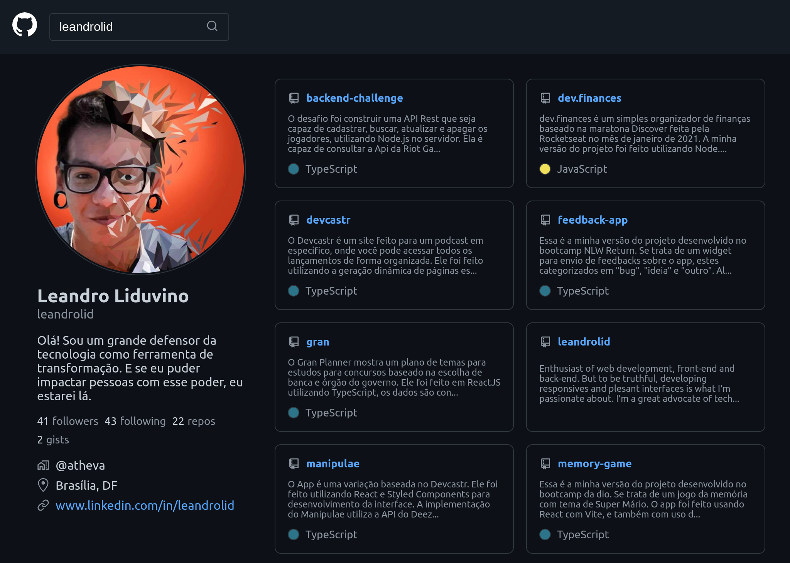

# Github Search

<p>
  
  
  <a href="https://github.com/leandrolid/github-search/commits/main">
    
  </a>
</p>

## Tópicos 

[Preview](#preview)

[Sobre o Github Search](#sobre-o-github-search)

[Tecnologias](#tecnologias)

[Instalação e uso](#instalação-e-uso)

<br>

## Preview

<a title="Github Search" href="http://leandrolid.github.io/github-search" >Clique aqui </a> para ter acesso a um  preview do App.

## Sobre o Github Search

Essa é a minha versão do projeto desenvolvido no bootcamp da dio. Se trata de um clone do Github onde é possível buscar usuários pelo username e listando suas informações e repositórios públicos.

O app foi feito usando React com Vite, e também com uso do TypeScript.
<br>
<br>

<p align="center">

</p>

## Tecnologias

Tecnologias e ferramentas utilizadas no desenvolvimento do projeto:

- [React](https://reactjs.org/)
- [TypeScript](https://www.typescriptlang.org/)
- [Vite](https://vitejs.dev/)
- [VS Code](https://code.visualstudio.com/) com [ESLint](https://eslint.org/)

<br>

## Instalação e uso

```bash
# Abra um terminal e copie este repositório com o comando
git clone git@github.com:leandrolid/github-search.git
# ou use a opção de download.

# Entre na pasta web com 
cd github-search

# Instale as dependências
npm install

# Rode o aplicação
npm run dev

# Acesse http://localhost:3000 no seu navagador.
```


---

Feito com :purple_heart: by [Leandro Liduvino](https://github.com/leandrolid)
